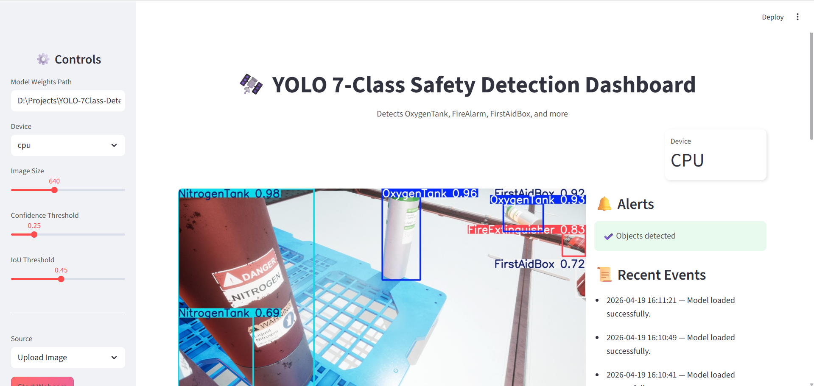

# YOLO 7-Class Safety Equipment Detector



This project uses YOLO to detect 7 distinct classes of safety and emergency equipment in industrial and office environments.

### Detected Classes:
- **OxygenTank**
- **NitrogenTank**
- **FirstAidBox**
- **FireAlarm**
- **SafetySwitchPanel**
- **EmergencyPhone**
- **FireExtinguisher**

---

## Project Structure
```
YOLO-7Class-Detection/
├── src/
│   ├── train.py
│   ├── infer_image.py
│   ├── infer_video.py
│   └── infer_webcam.py
├── models/
│   ├── yolo11n.pt
│   └── yolov8s.pt
├── gui_app/
│   ├── main.py
│   └── yolo_worker.py
├── streamlit_app/
│   └── app.py
├── data.yaml
├── requirements.txt
├── .gitignore
└── README.md
```

## Setup
1. Clone the repository.
2. Create a virtual environment:
   ```bash
   python -m venv .venv
   source .venv/bin/activate  # Windows: .venv\Scripts\activate
   ```
3. Install dependencies:
   ```bash
   pip install -r requirements.txt
   ```
4. Place your weights in the `models/` directory (or use the provided ones).

## Training
```bash
python src/train.py
```

## Inference
### Image
```bash
python src/infer_image.py sample.jpg
```

### Video
```bash
python src/infer_video.py
```

### Webcam
```bash
python src/infer_webcam.py
```

## PyQt GUI
```bash
cd gui_app
python main.py
```

## Streamlit Dashboard
```bash
streamlit run streamlit_app/app.py
```
